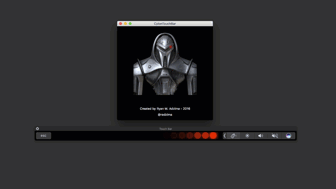

# Cylon TouchBar 
 

### Cylon LED eyes animation for your new MacBook Pro TouchBar based on the [Knight Touchbar 2000](https://github.com/AkdM/KnightTouchBar2000) project by Anthony Da Mota.

## Cylon Touchbar on Youtube

## Cylon Touchbar Preview

## How to use

1. Clone repository

    `git clone https://github.com/radzima/CylonTouchbar.git`

2. Run this command to launch the project in XCode (you must have XCode first)

    `cd CylonTouchbar && open CylonTouchBar.xcodeproj`

3. Build and run your very own cylon!
4. PROFIT!

or just  [download the latest release of the app here][latest-release] and open it.

## Features

* Cylon scanner animation
* Cylon scanning sound

## It's Free?!?

You're wondering how I can survive making such an amazingly useless app and not charing for it, aren't you? You can fix that... [donate here!][paypal]

## Follow me!

* Blog - [Techvangelist.net][techvangelist-site]
* Twitter - [@radzima][radzima-twitter]

[latest-release]: <https://github.com/radzima/CylonTouchbar/releases/latest>
[touchbar-launcher]: <https://github.com/zats/TouchBarLauncher>
[techvangelist-site]: <https://techvangelist.net>
[radzima-twitter]: <https://www.twitter.com/radzima>
[paypal]: <https://paypal.me/radzima>
